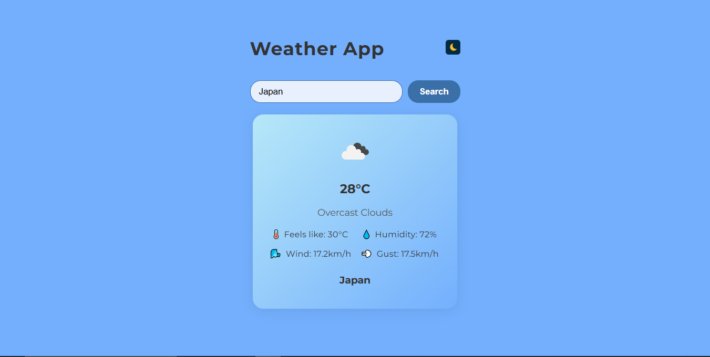
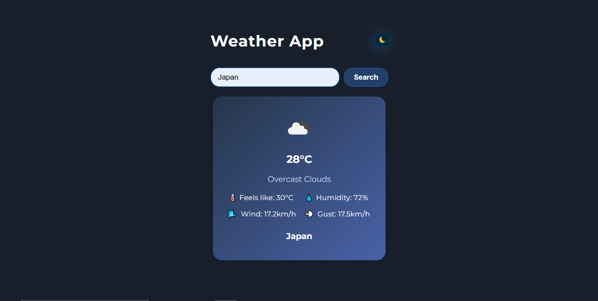

# 🌤️ Weather App

A simple and responsive weather forecasting web app built with **vanilla JavaScript** and the **OpenWeatherMap API**.  
Users can search for any city to view the current weather, temperature, humidity, wind details, and more.

---

## 🚀 Features

- 🌍 Search weather by city name (real-time data)
- 🌡️ Shows temperature, humidity, feels-like, wind speed, and gust
- 🌓 Dark mode toggle for better user experience
- 📸 Dynamic weather icons based on condition
- ⚠️ Alerts user if city is not found (error handling)

---

## 🛠️ Tech Stack

- HTML5, CSS3
- JavaScript (ES6)
- OpenWeatherMap API

---

## 📸 Screenshots

### ☀️ Light Mode


### 🌙 Dark Mode



---

## 🧩 How It Works

1. User enters a city name in the input field
2. On clicking **Search**, app sends request to OpenWeatherMap API
3. API response is parsed and weather info is displayed dynamically
4. Dark mode toggle updates the UI theme using CSS class toggling

---

## 📦 Setup Instructions (for local run)

```bash
git clone https://github.com/kaizenarin/weather-app.git
cd weather-app
open index.html in your browser
